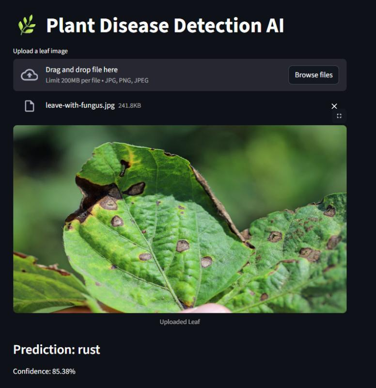

# 🌿 Plant Disease Detection AI

<div align="center">


# 🌱 Plant Disease Detection AI

### AI-Powered Plant Leaf Disease Classification using Deep Learning & Computer Vision

<p align="center">
Detect plant diseases from leaf images using a CNN-based Deep Learning model built with PyTorch and deployed using Streamlit.
</p>

<br>


</div>

---

# 📌 About The Project

Plant diseases significantly affect agricultural productivity and crop quality. Early disease detection can help farmers take preventive actions and reduce losses.

This project uses **Deep Learning**, **Computer Vision**, and **Artificial Intelligence** to classify plant diseases from leaf images with high accuracy.

The application allows users to upload a plant leaf image and instantly receive disease predictions through a user-friendly web interface.

---

# 🚀 Features

✅ Plant Disease Prediction  
✅ CNN-Based Deep Learning Model  
✅ Image Upload Functionality  
✅ Real-Time Disease Analysis  
✅ Streamlit Web Application  
✅ Fast & Accurate Predictions  
✅ Multi-Class Classification  
✅ Responsive User Interface  
✅ AI-Based Agricultural Assistance  

---

# 🎥 Project Demo

<div align="center">

## 🌿 AI Disease Detection Demo


</div>

---

# 🧠 AI Workflow

```mermaid
graph LR

A[Leaf Image Upload] --> B[Image Preprocessing]
B --> C[Image Resize & Transform]
C --> D[CNN Deep Learning Model]
D --> E[Disease Prediction]
E --> F[Prediction Result Display]
